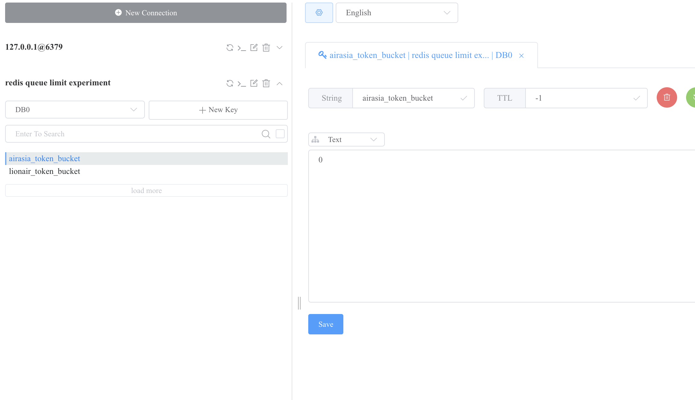
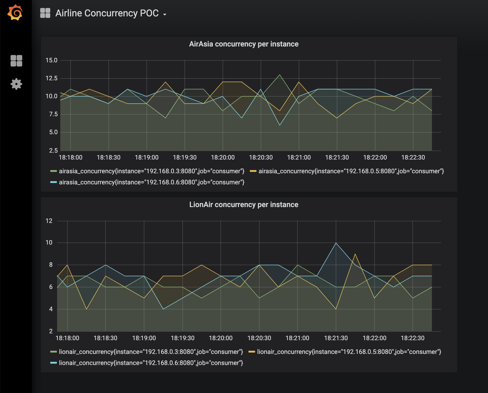
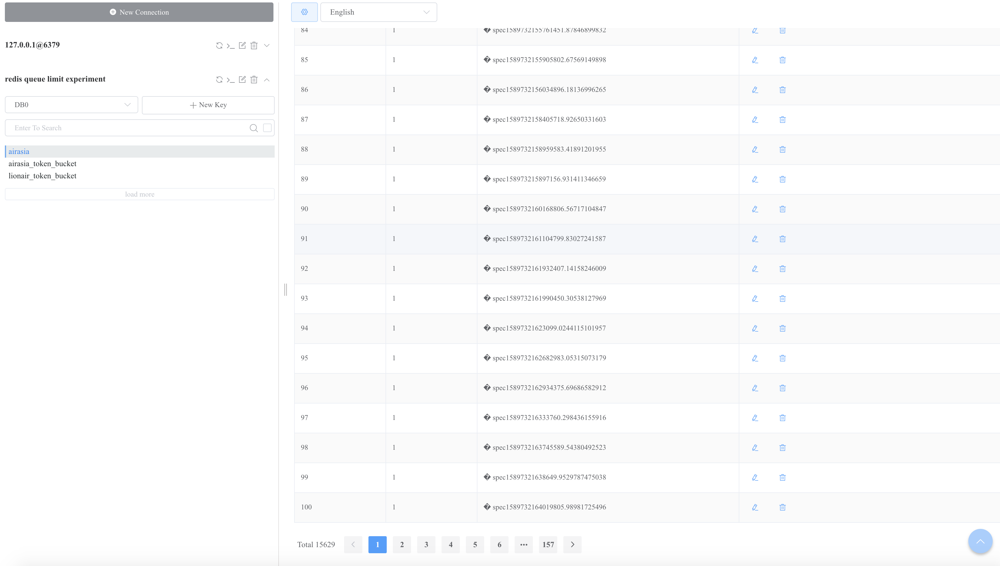

## Redis-backed Distributed Job Queue w/ Rate Limiter

A proof-of-concept to show how redis is a viable option for the following use case:

- multiple job queues (lionair, airasia)
- multiple consumer pools reading from queues
- distributed queue / job scheduler
- max concurrency of jobs being processed per queue (example: lionair = 20 jobs, airasia = 30 jobs concurrently)

## Running load tests and observing concurrency

1. Install [k6](https://k6.io/docs/getting-started/installation)
2. Run the entire setup, with 3 consumers - `docker-compose up --scale consumer=3`
3. Run the loadtest with (X concurrent users over Y duration) - `k6 run --vus 300 --duration 120s k6.js`
4. Observe the redis token bucket drop to 0:



5. Observe distribution of load on [grafana](http://localhost:3000/d/1w-O5PgMz/airline-concurrency-poc?orgId=1&refresh=5s).



6. Observe the queue build up



## Development

1. Make your code changes
2. Rebuild changed code - `docker-compose build`
3. Bring up the entire setup - `docker-compose up`

```

## Test with postman / cURL

Queue a job:

```

curl --request POST \
 --url http://localhost:8081/queueJob \
 --header 'content-type: application/json' \
 --data '{
"queueId": "airasia",
"name": "spec2",
"score": 2.1
}'

```

## WIP

- Pending addition of [pumba](https://github.com/alexei-led/pumba) to simulate failures
- Fix the karate loadtests, somehow its not triggering load in the same behavior as k6
```
